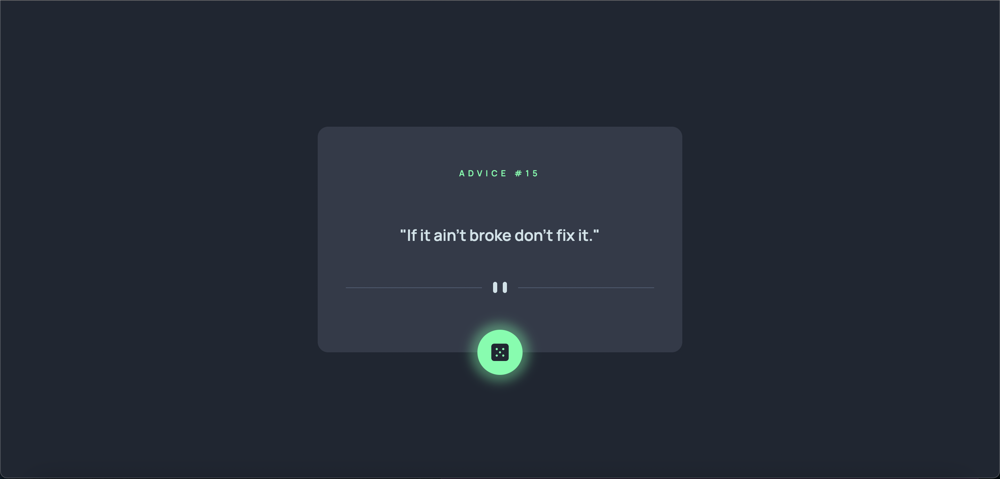

# Frontend Mentor - Advice generator app solution

## Table of contents

- [Overview](#overview)
  - [The challenge](#the-challenge)
  - [Screenshot](#screenshot)
- [My process](#my-process)
  - [Built with](#built-with)
  - [What I learned](#what-i-learned)
  - [Continued development](#continued-development)

## Overview

### The challenge

Users should be able to:

- View the optimal layout for the app depending on their device's screen size
- See hover states for all interactive elements on the page
- Generate a new piece of advice by clicking the dice icon

### Screenshot

### Links

- Solution URL: [Solution](https://www.frontendmentor.io/solutions/responsive-design-fetch-api-method-flexbox-gZCMvpTbnr)
- Live Site URL: [Live Site](https://tanereren.github.io/Frontend-Mentor-02-Advice-Generator/)

## My process

### Built with

- Semantic HTML5 markup
- CSS custom properties
- Flexbox
- Mobile-first workflow

### What I learned

This project was great to practice using the fetch method for API calls as well as creating HTML elements straight from the javascript document.
I focused on the project using a mobile-first approach although the design was simple enough to not require much effort to make it responsive.

### Continued development

I'd like to incorporate different APIs in future projects as well as create more complex designs. 
These simple projects are helping me get acquainted with frontendmentor, which seems to be an excellent resource for practicing and improving my skills.
